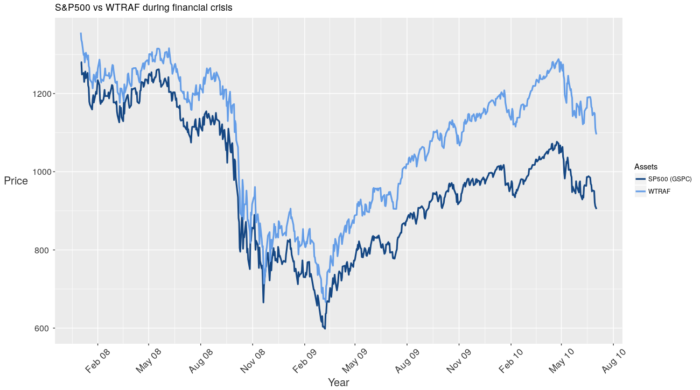

# Industry Risk Parity Portfolio

This is the final project for 15.417 (Laboratory in Investments/Managerial Finance).

 This portfolio seeks to provide exposure to the U.S. equities market while protecting against isolated shocks and volatility within specific industries, ultimately providing a higher return for a given level of risk. This is achieved by decreasing weightings of relatively risky assets and increasing weightings of lower risk holdings. This builds off of previous work in risk parity portfolios. However, instead of allocating capital based on risk of different assets classes such as equity, debt, and commodities, this portfolio allocates capital based on risk of different industries within the S&P500. 

 The portfolio employs a smart-beta strategy to allocate capital across 11 Vanguard industry ETFs: VCR (Consumer Discretionary), VDC (Consumer Staples), VDE (Energy), VFH (Financials), VHT (Healthcare), VIS (Industrials), VGT (Information Technology), VAW (Materials), VNQ (Real Estate), VOX (Telecommunication Services), and VPU (Utilities). Each ETF represents a different industry, and these industries are chosen to be exclusive and exhaustive in the market. Risk for any given industry is proxied using the covariance of daily returns across industry ETFs. The portfolio is rebalanced each month based on the risk calculated from a nine-month trailing window of returns. We choose a nine-month window as we find it to approximately maximize the portfolio Sharpe Ratio. 

 Over a hypothetical period from November, 2004 to December, 2017, we see the following results for this portfolio: 

| Metric                                   | Performance |
|------------------------------------------|-------------|
| Annualized Average Return                | 10.79%      |
| Annualized Standard Deviation of Returns | 17.99%      |
| Sharpe Ratio                             | 0.60        |

 Over the same period, we see the following results for the S&P500: 

| Metric                                   | Performance |
|------------------------------------------|-------------|
| Annualized Average Return                | 6.54%       |
| Annualized Standard Deviation of Returns | 18.81%      |
| Sharpe Ratio                             | 0.35        |

 The portfolio sees a higher annualized average return and a low annualized standard deviation of returns than the S&P500, producing a significantly higher Sharpe Ratio. 

 The following graph illustrates the hypothetical performance of the portfolio over a 13-year period from October 4, 2004 to December 29, 2017, assuming equivalent initial investments of $1,000 into the portfolio and into the S&P500.  

 The following graph illustrates the hypothetical performance of the portfolio during the 2008 Great Financial Crisis compared to the S&P500 over the same period. 

