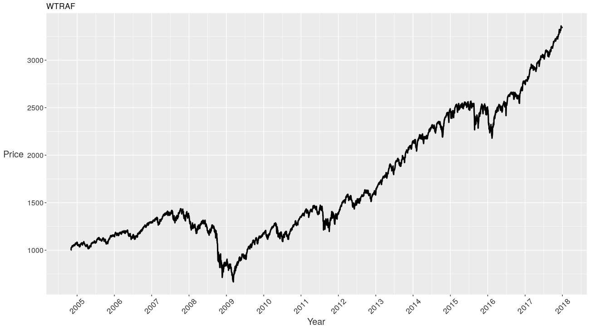
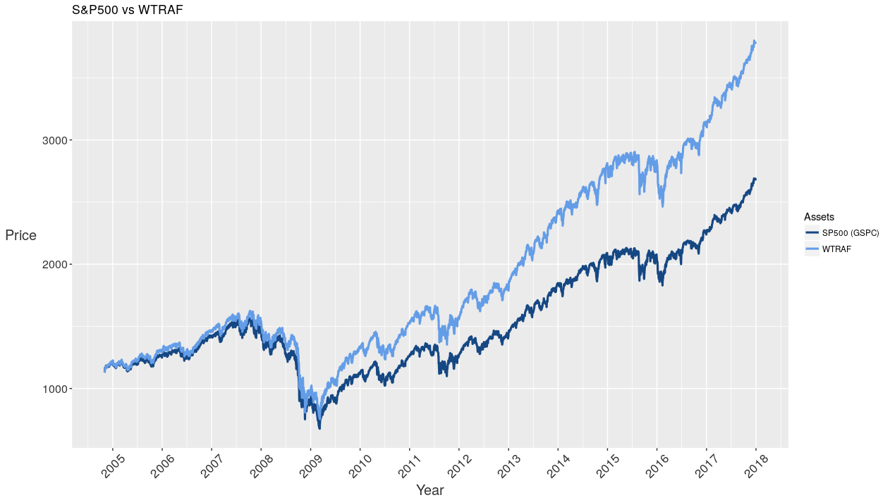

# Industry Risk Parity Portfolio

## Description

This is the final project for 15.417 (Laboratory in Investments).

This portfolio allocates capital based on risk contribution to the entire portfolio rather than based on some set capital allocation. It is designed to accurately represent the US market by allocating risk contribution to different industries based on their capital allocation in the S&P500. Ideally, this reduces risk of market shocks on the portfolio while continuing to capture the growth of the economy.

This builds off of previous work in risk parity portfolios across various asset classes by extending it to different industries, rather than different asset classes, and defining specific risk contribution vectors.

Performance of our portfolio over a 13 year period.

Performance of our portfolio versus its benchmark, the S&P500, over this period.

This is a work in progress.
